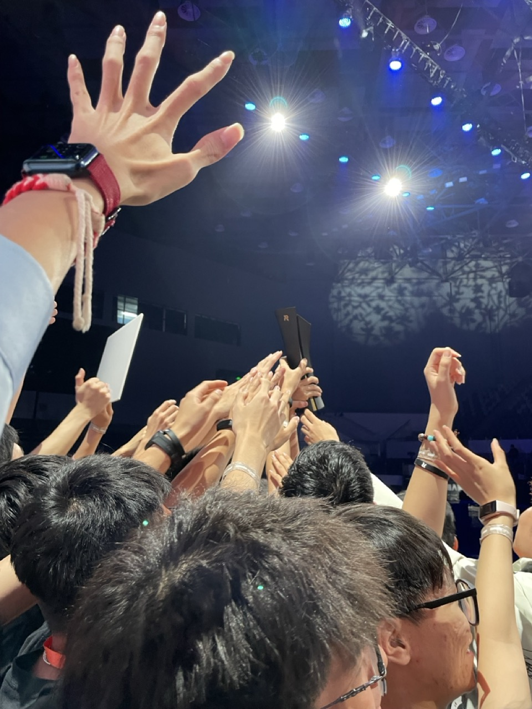

This project is a library for RoboMaster computer vision based on OpenCV. The functions that currently implemented includes:

- DaHeng industrial camera driver
- Image preprocessing
- Pattern matching for light blob and armour
- Serial port communication
- Gravity compensation
- SVM for object classification and tracking
- Kalman Filter for movement prediction

Source Code: [rmcv on GitHub](https://github.com/deemoe404/rmcv)

## Live Demo

> The movement prediction in this video is based on a simple Kalman Filter running on STM32 lower computer, since the project is still in progress at the time.

## Recent Updates

- Aug 24, 2024: Added foundation for Movement Prediction, including a simple Kalman Filter and Object Classification/Tracking using SVM.
