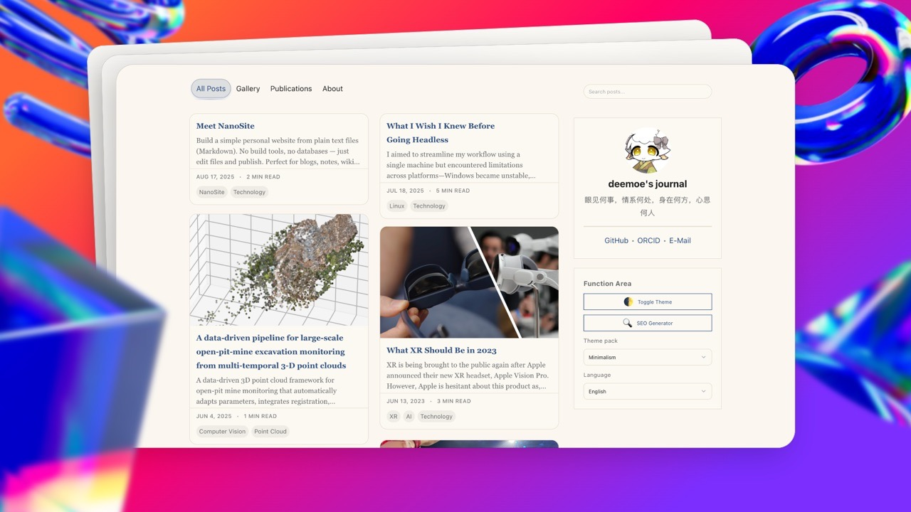

Source Code: [NanoSite on GitHub](https://github.com/deemoe404/NanoSite)

## Highlights

- Write in **Markdown**
- Works on **GitHub Pages** (free hosting)
- Search, tags, reading time, dark mode, and theme packs
- Optional tabs (About, Projects, etc.)
- Optional multi‑language UI and posts
- Automatic Table of Contents with copyable anchors
- Built-in pagination for large indexes and searches

## Quick Start in 5 minutes

1) **Get the project On [GitHub](https://github.com/deemoe404/NanoSite/)**: Fork or simply download ZIP and unzip.
2) **Preview locally** (recommended)
  - In the project folder, start a simple server:
    - macOS/Linux: `python3 -m http.server 8000`
    - Windows (PowerShell): `py -m http.server 8000`
  - Open `http://localhost:8000/` in your browser.
3) **Set your site name and links**
    - Open `site.json` (in the project root) and edit basic settings:
  ```json
  {
    "siteTitle": "My Site",        // Title of your site
    "siteSubtitle": "Welcome!",    // Subtitle for your site
    "avatar": "assets/avatar.png", // Path to your site avatar image
    "profileLinks": [
      { "label": Github/Twitter/..., "href": URL to Profile }
    ]
  }
  ```
4) **Start writing!**
  - Create a new Markdown file under `wwwroot/`, for example `wwwroot/my-first-post.md`:
  ```markdown
  # My First Post

  Hello! This is my first post. I can write text, lists, and add images.
  ```
  - Register it in `wwwroot/index.json` so it shows on the homepage:
  ```json
  {
    "My First Post": {
      "location": "my-first-post.md", // Path to the Markdown file
      "tag": ["Note"],                // Tags for the post
      "date": "2025-08-13"            // Publication date
    }
  }
  ```

🎉 Congratulations! You've set up your NanoSite. Reload the page, and you should see your post card on the homepage. Click to read it. For more customization options, check the [documentation](?id=post/meet-nanosite/doc_en.md).
