> [!warning] 多图杀猫：本文内含大量图片，流量党慎入！（土豪随意）

虽然标题讲的是纽约，但实际上这次去的是上海。

其实我向来对旅行都不太感兴趣，不论是短途还是长途。

曾经也以各种五花八门的目的去过不少其他城市，比方说长沙和成都。它们都不缺乏繁华、地方特色，以及以我自己的话来说，“有底蕴”的地方：例如长沙的橘子洲头，成都的熊猫基地等等，但我在那些地方走着总感觉提不起什么兴趣。

## Jo: RIALTO

其实这是我第一次看 Live House，甚至说来惭愧，我在抵达现场之前连即将登场的乐队是哪一支都不知道。（全权听从同伴的安排！）但由于距离演唱会开始时间还早，我们同行几人商量了一下，决定去有“秋叶原平替”之称（据我一位同学所说）的南京路步行街逛一圈。

走的远远的就看到的巨幅罗小黑主题 LED 广告：

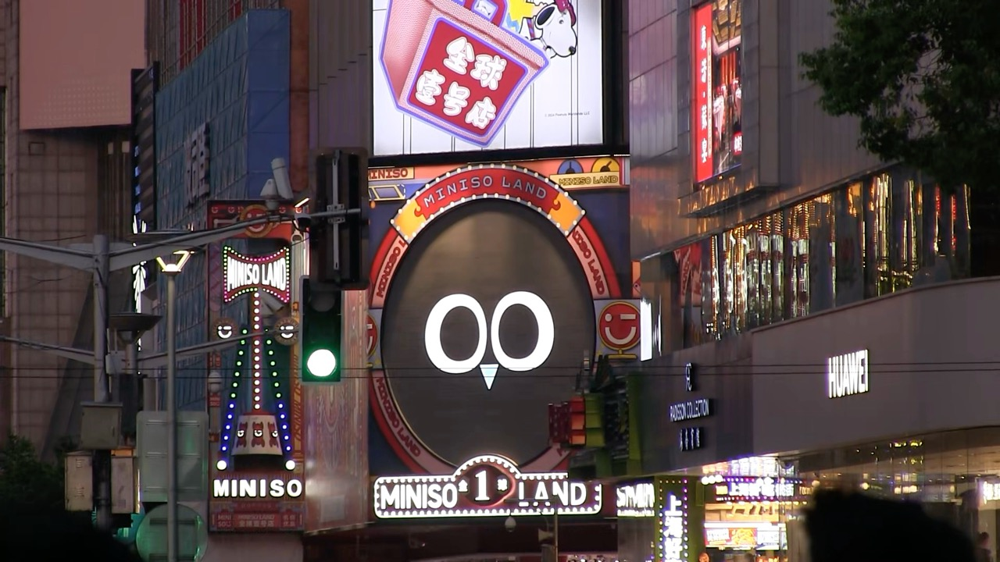

要不怎么说是大城市呢？在成都踏破铁鞋无觅处的华为三折叠、折叠屏笔记本电脑、Miniso 罗小黑联动区域，在这里真可谓是“得来全不费功夫”（只有小黑联动的照片，在成都的时候因为拍摄华为门店被店员盘问了半天，这次不敢了🧎‍♀️）……

好多小黑毛绒：

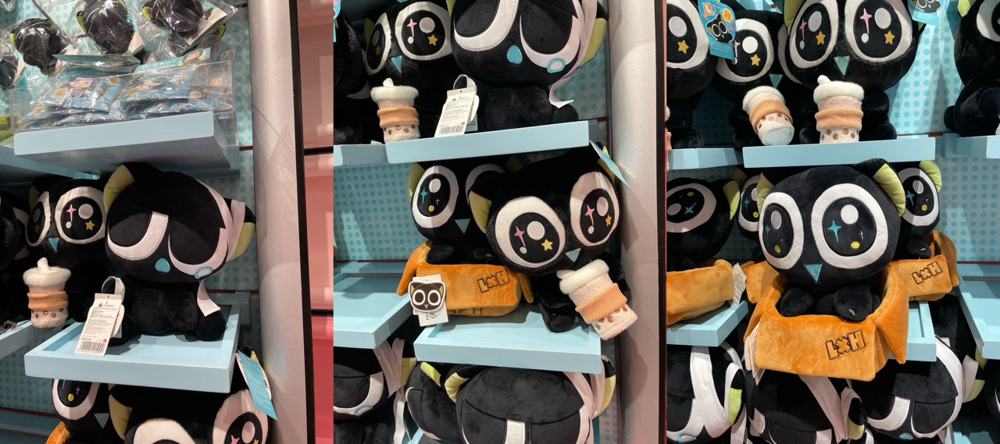

更多小黑毛绒（和小塑料片）：

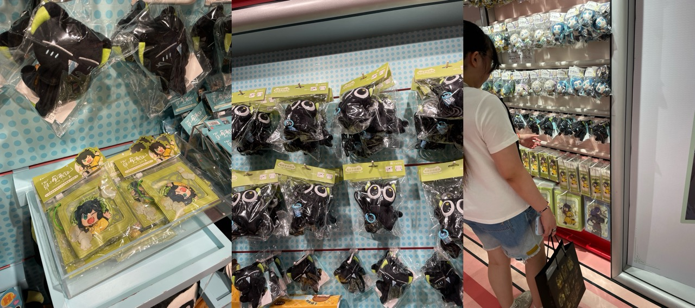

最后当然是舍不得买非常喜欢的受伤流泪小黑（其一，左）只能买一个三角嘴巴肩上趴趴小黑（其二，左上）啦～虽然第二天还是兴冲冲跑回去买了一个，因为看到淘宝上面的价格也差不多。（不过也只能买一个了，虽然也很喜欢小箱子猫）

然后就到了演唱会时间。本来是打算打车的，但是上海的公共交通发达程度超乎我们的想象——高德地图显示我们坐公共交通过去还要比打车快十几分钟。为什么要把这一段单独拿出来讲呢？因为……上海地铁 3 元钱给咱们吐了 2 张票（目移）。不过再次给高德地图加一分，估计的到达时间准的可怕。

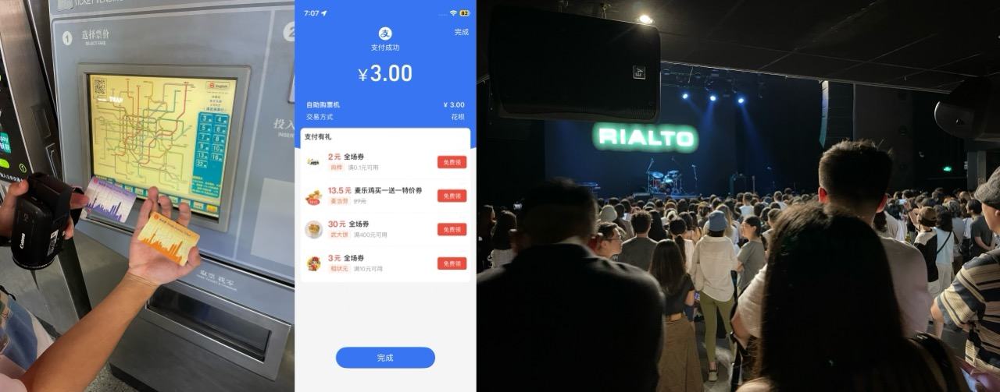

在来之前，组织这次行程的小伙伴一直在和我们剩下的人说，他很担心这次演出效果不好让我们扫兴了。但我得说，我作为一只第一次进城看演唱会的土狗（土猫）对现场的表演还是感到很惊艳的，其中几首差距听过的歌甚至都觉得和 Apple Music 上的录音室版本没什么区别！虽然有一位挑剔的朋友事后一直在纠结主唱究竟有没有 lower 一个 key。🤣

而且主唱的英国口音实在是太好听了，控场感也很好——中途吉他手因为吉他需要重新调音乐队暂时退场了一段时间，主唱在台上就轻松地和观众解释情况，然后抱起吉他来了几首自弹自唱。虽然遗憾的是，后续的整场演出吉他手依然时不时拧一下他的吉他，看来是暂时退场也没能完全修复主唱说的“Technical Issue”。

一些现场图片：

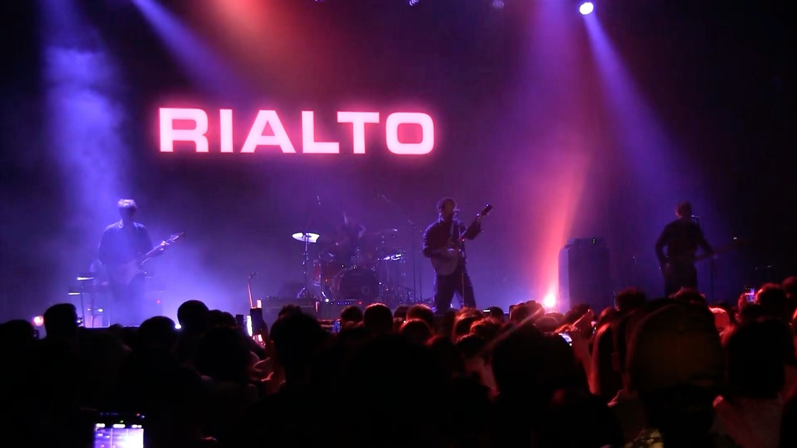

小队长本来是打算在演出结束后买一张签名的 CD，但是我们分头打听了一阵后遗憾地发现签售环节已经在演出开始前就结束了（怎么听起来有点绕😵‍💫）。不过奇怪的是 Live House 的入口莫名排起了长队，问了几个排队的人都表示他们自己也不知道这队是在排什么，但就是排了（人类的本质🤣）。

我们商量了一下，因为我们明天还打算在白天再逛一逛上海，于是决定不排这队了先回去。走到队末的时候，刚好遇到一位粉丝给在场的人分发自己制作的乐队明信片。我因为到看完还不知道乐队的成员都叫什么名字所以不好意思拿，但小队长超级高兴地拿了一张：

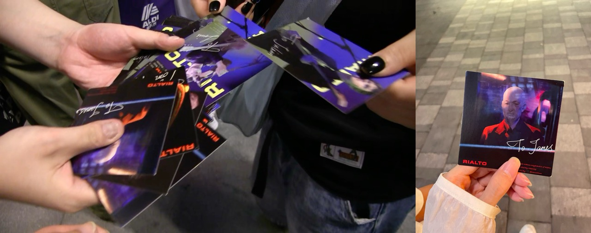

## Ha: 一生一世为钱币做奴隶～

来都来了，纸醉金迷的上海滩也是要体验一下的（逛昨天没逛完的秋叶原平替）。大型毛绒玩具商场嘛，没什么好说的直接看图～

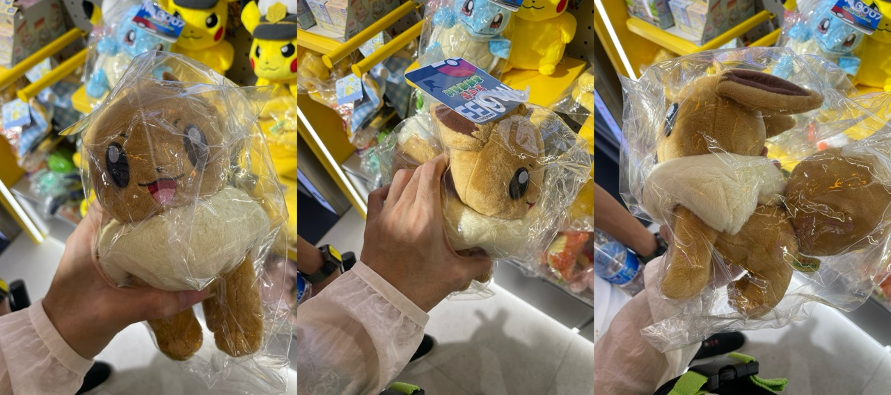

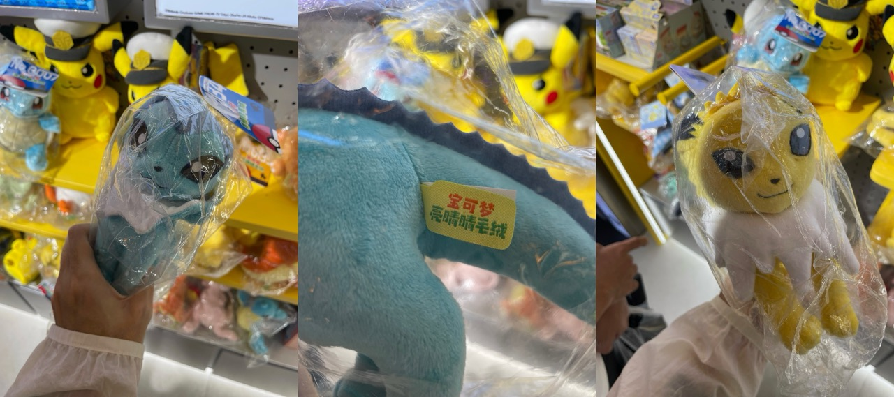

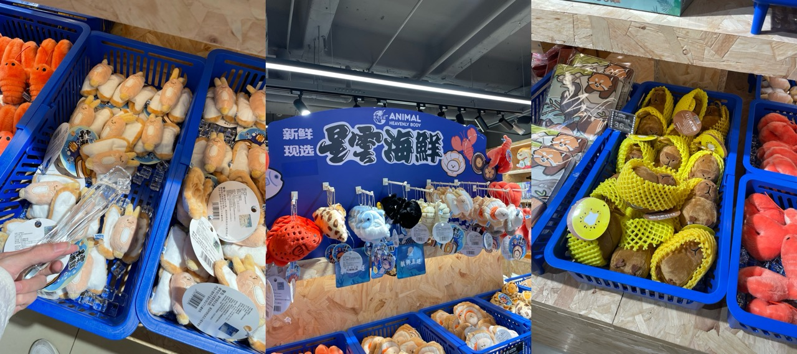

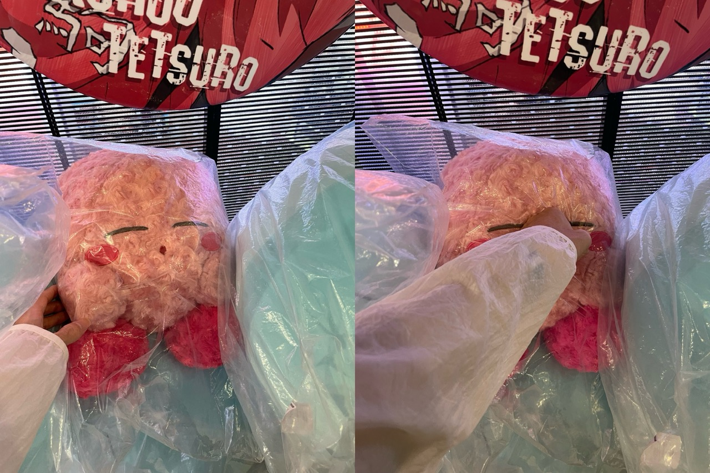

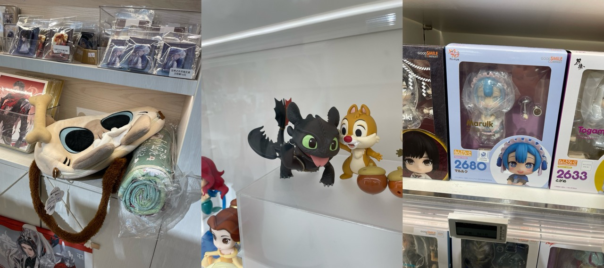

有趣的是，在路过三星展台的时候眼尖（果蛆）的我发现三星用的这个图标有点不对劲，好像是从 iOS 里拿过来的！虽然现在仔细一看好像还是有一点差别，但是差别真的不大好吗……三星你知道这个[图标里的波形是“Apple”这个单词的发音](https://x.com/flyosity/status/591298868849025027)吗？🤣

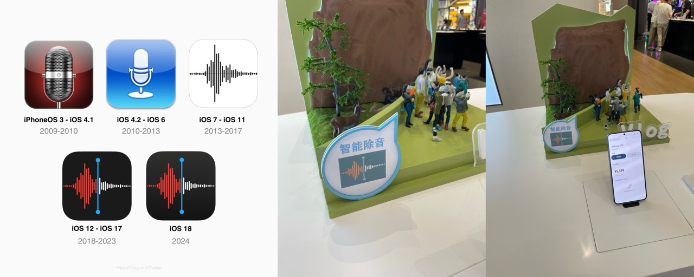

## Q: The Build

今天其余几位同行的小伙伴们都回去上班了，只有我这个无业游民还在上海继续晃悠。这次行程住的旅店环境虽最多只能用一个“平庸”来形容，但好在它离 8 号线地铁站不远，去什么地方都挺方便。而且还毗邻外滩！那看来外滩肯定是是不得不去一趟了。

不知道从什么时候开始（有可能是拥有它的第一天），我的 OPPO 手机地图上的指南针就失灵了。平时都只能先随便朝一个方向走一段路，好让地图利用前进方向自动校准我的朝向。但这次去外滩的路实在是太短了，因此我就索性浏览了一遍地图，记下几个地标，数了数十字路口的数量就把手机装进小包里出发了。

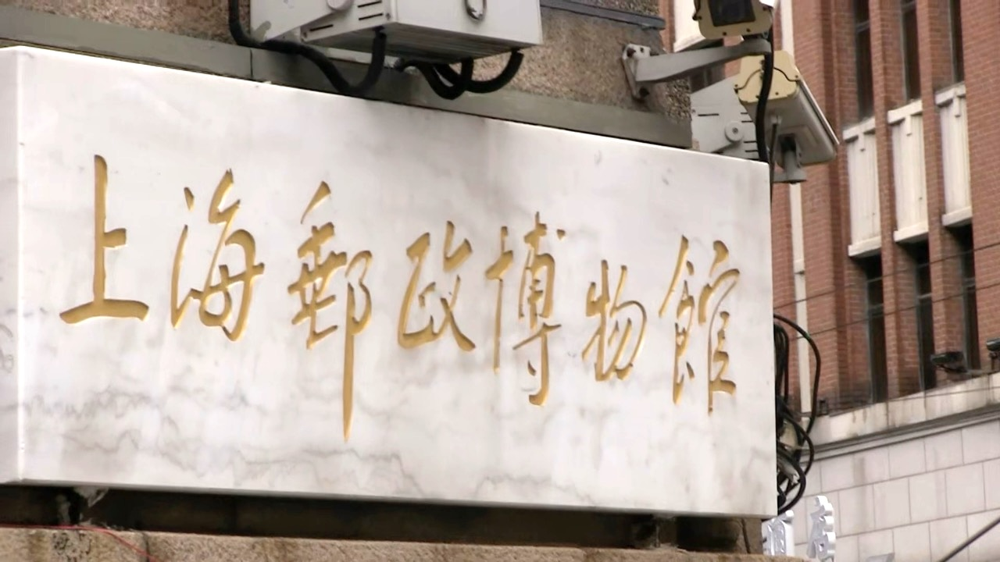

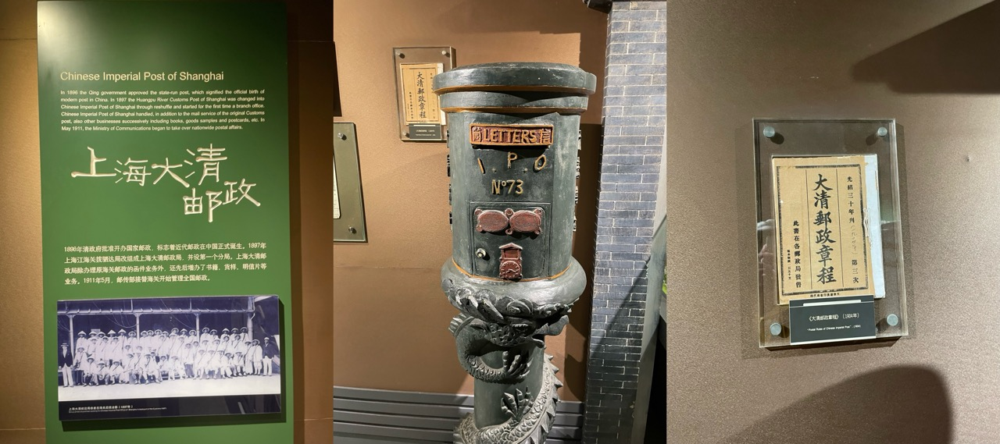

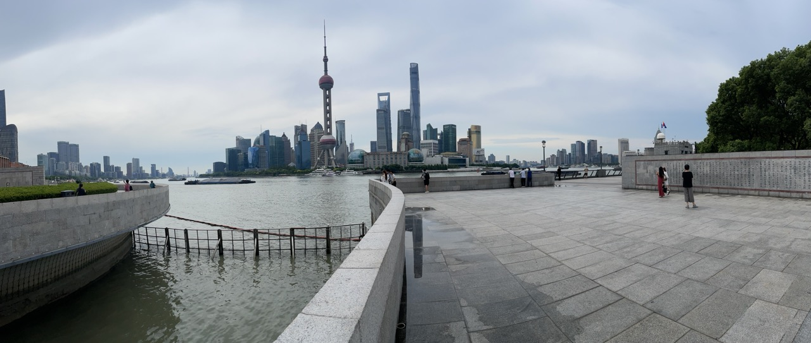

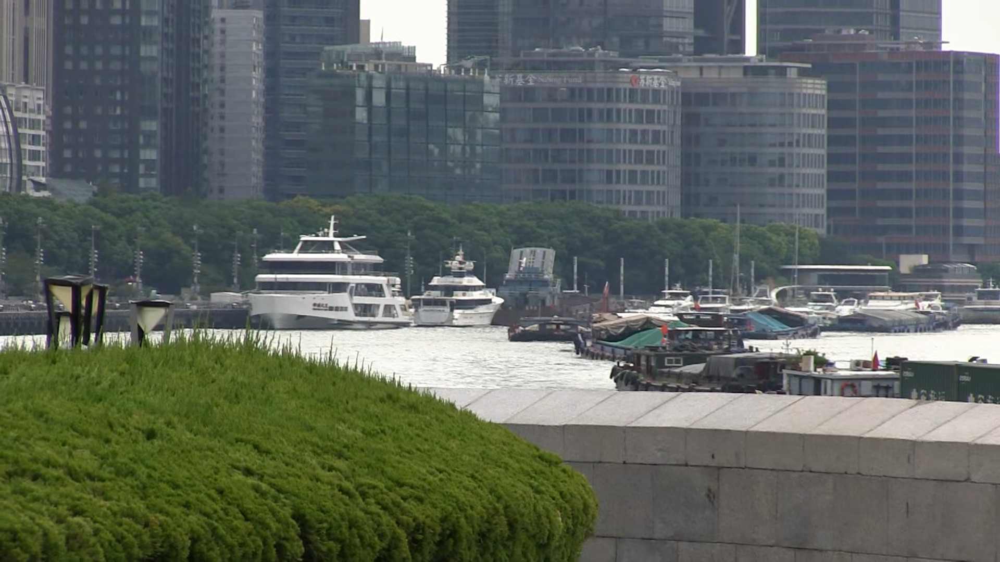

## Shin: 飞机

> 哦对了，多说一句——上海的空气质量是真的好，缓解结膜炎的药水带去几乎没有派上过用场😊。
