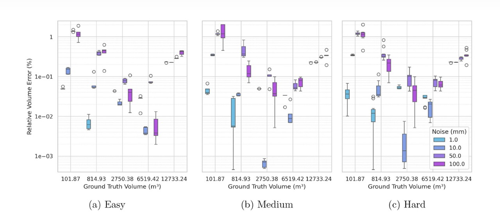

This project proposes a data-driven framework for excavation monitoring in large-scale open-pit mines using 3D point clouds. Unlike traditional methods that rely on manual parameter tuning, it automatically adapts key parameters (e.g., ICP correspondence distance, clustering thresholds) based on scene statistics, enabling robust performance under noise, misalignment, and varying point densities.

The workflow integrates coarse-to-fine registration (EGS + G-ICP), robust change detection (M3C2 with adaptive scaling), and DEM-based volumetric analysis. Experiments on benchmark datasets and a real limestone quarry demonstrate that the method achieves sub-2% volume error even under challenging conditions, offering a reliable and automated solution for sustainable and intelligent mining practices.

Source Code: [volcal_baseline on GitHub](https://github.com/deemoe404/volcal_baseline)
Paper: [IET Image Processing](https://doi.org/10.1049/ipr2.70130)

## Recent Updates

- Jul 26, 2025: The pipeline is now available on **Android embedded devices** (e.g. DJI Remote), see [volcal_baseline_android](https://github.com/deemoe404/volcal_baseline_android) for more infomation.
- Jul 25, 2025: The pipeline is now available as a **web service**, see [volcal_baseline_server](https://github.com/deemoe404/volcal_baseline_server) for more infomation.
