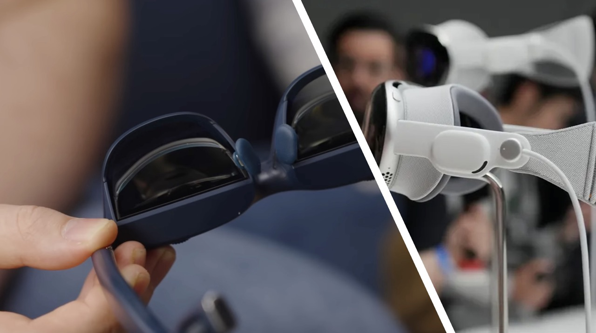
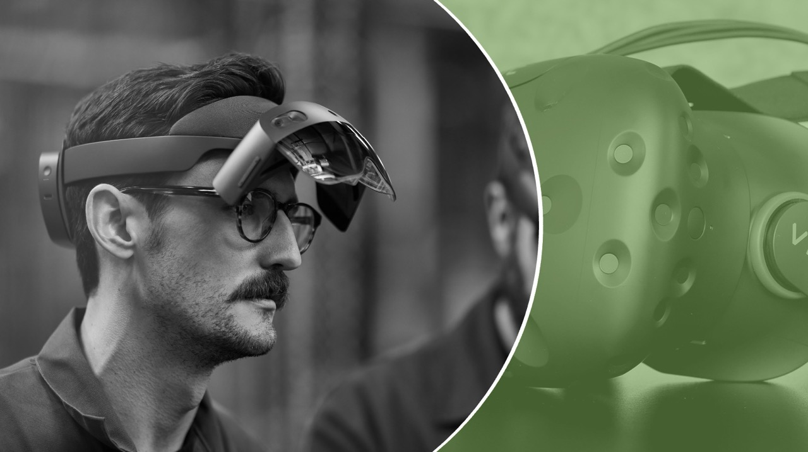
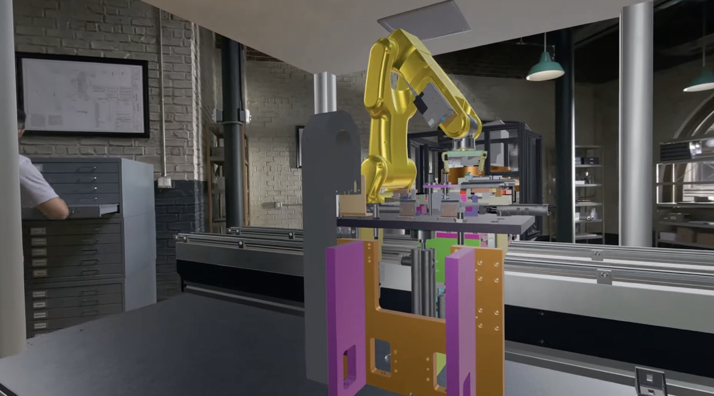

## Is Vision Pro the Answer?

Apple is currently making the most powerful mobile chip and personal software on the planet. No other company can build a knock-off Vision Pro because they don't have the M2 chip or the Apple Software Team. However, the crucial question remains: is it becoming a good "XR" with these cutting-edge technologies?

While the Vision Pro may have the most powerful system to passthrough the reality to you, it still has its limitations. You need to be mindful of the power cable, maintain a stationary head position, and wearing it for several hours can lead to significant neck fatigue, preventing prolonged immersion in the XR world.

> I'm not saying Vision Pro is bad. To be frank, they are creating one of the best "headsets" available right now. It's great for entertainment purposes and can be used as a **gigantic monitor** or for "**Spatial Computing**".

## The Two "R"s

There are two categories of "R"s out there. One aims to provide extra content in your vision (XR), while the other is more like a "display" rather than something entirely new (VR). Microsoft Hololens focuses on the first category, HTC Vivw falls into the second category, while Apple is attempting to combine both aspects simultaneously.

This article will only be discussing the second category since "VR" is already quite good at utilizing desktop graphics. Since "XR" refers to "Extended Reality", what kinds of extra information it can add to our reality?

## What "Extra" Content do We Needs?

The Hololens and Vision Pro both mention a type of assistance that their devices can provide: 3D instruction in real life. However, what about the moments when you want to sit down, relax, and contemplate your real-life needs without the sci-fi scenes they present to you?

Hololens is designed for military and industrial usage, but Apple? Really? 

For most people, something that we really do in everyday life is more like:

1. Checking the map while traveling
2. Receiving guidance during yoga sessions
3. Tracking calories intake throughout the day
4. Asking for help when cooking

...

None of these tasks could NOT be done without visual instructions, right?

## The XR "Earphone"

The term "XR" doesn't imply that it has to be a monitor strapped to your face. Why can't it be something more wearable and adorable, like earphones, or even with a built-in camera?

AI these days is quite different from back in the days when HTC Vive was launched. AI from Facebook can perform image segmentation on objects it has never seen before, while ChatGPT can seamlessly handle NLP and network searches just like human dose. We are now in a new era where computers can understand the world like never before.

You might anticipate what I am about to say, right? *(merely a bluetooth earbuds with a "secretary" built inside 🤣)*

The "XR earphone" is definitely not my original, and companies like Apple are unlikely to prioritize it since it may seem too trivial compared to the Vision Pro, which offers **much more capabilities** than a mere earphone.

> But integrating it with Siri could be interesting.

However, I still believe that such a concept is highly useful and **feasible** in 2023.

## What's More

The inconvenience of XR headsets primarily stems from having to wear a bulky device. However, if the "XR content" is primarily audio-based, why couldn't one simply fill their house with soundbars and cameras?

> "Okay, the microwave oven is set to 15min, over medium heat, and? What's next?"
> 
> "Prepear the sauce."
> 
> "Hmmm, sauce... where is the sauce..."
> 
> "It's on your left hand side, next to the Apple."

## But...

Yes, there is a lot more that needs to be discussed, such as privacy concerns.
