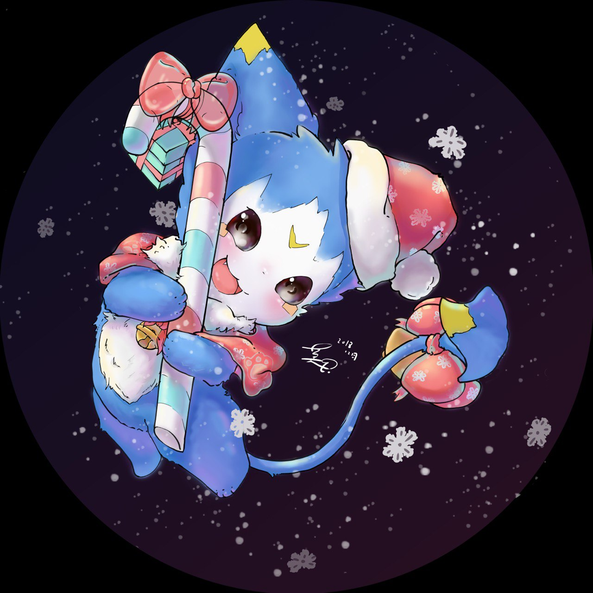

A cat who lived long enough.

It has outlasted every dawn,
outlived more gatherings than all its kind combined—
and it has endured more partings, more desolation, than any creature should.

Once it crouched beneath a sagging roof,
watching a child stumble from first words into the weariness of white hair.
Once it curled in the fissures of ruined stone,
listening as the wind and sand smothered the last breath of a city.

In its eyes, the colors of time accumulate:
the verdant shimmer of spring,
the humming chorus of summer nights,
the solitude of autumn frost,
the hush of winter snow.
It no longer chases birds, nor toys with its own shadow.
Instead, it keeps its gaze upon the moon—
as though whispering to a companion who dissolved long ago into silence.

To live so long is to lose one’s name.
People have called it a thousand things,
but each name thins like smoke and fades among its whiskers.
Only the cat remembers:
it is the witness to every tale,
and the resting ground of every forgotten dream.

And sometimes, before the world stirs at dawn,
it breathes a low, fragile song—
a reminder to the sleeping earth:
“I am still here.
But you… are long gone.”

### You might want to know them too...

[Alvin](https://blog.alubin.space/)

[Meteor](https://Ghl.info/)

[Jelly](https://blog.jellyqwq.top)

[Quantum Cookie](https://www.quantumcookie.xyz)

[LeZi](https://leziblog.com)

[cmjang](https://cmjang.github.io/)
