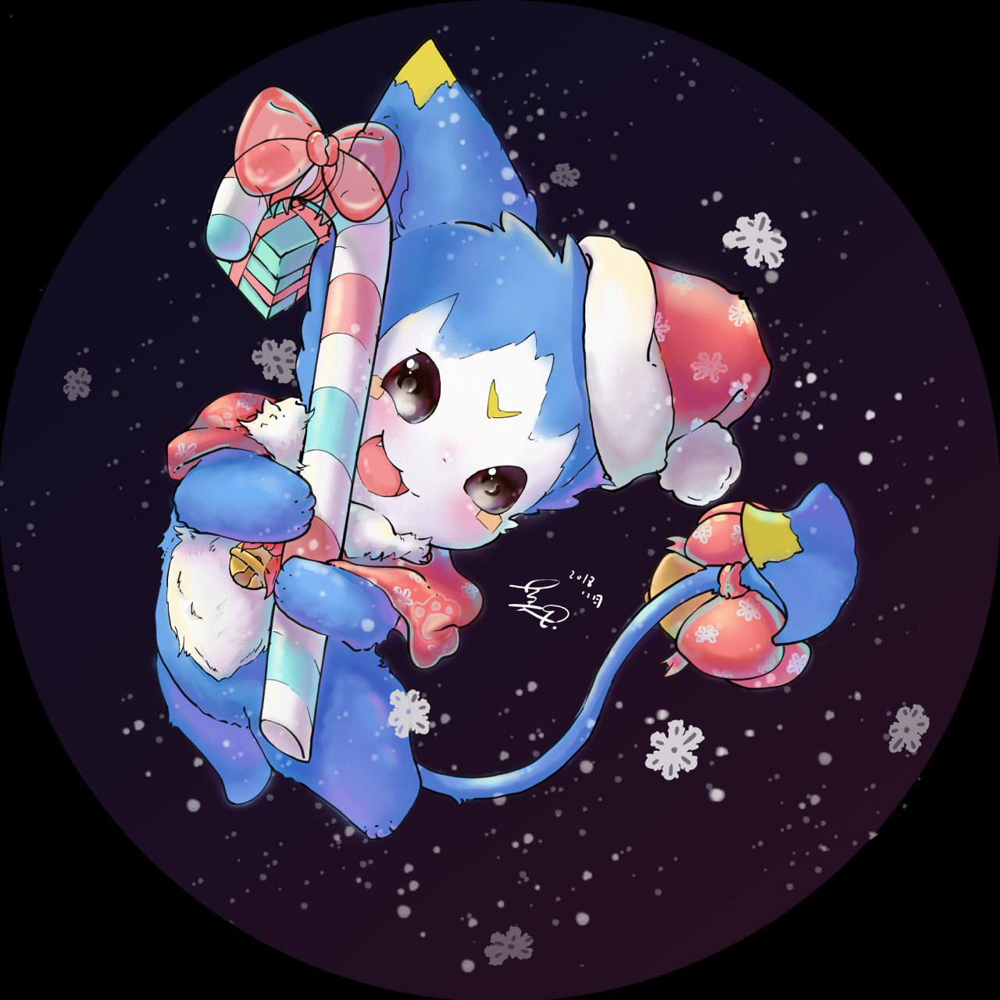

一只活得足够久的猫。

这只猫见过比有史以来所有的猫都要多的日出，相聚；
也见过比所有的猫都要多的离别与荒凉。
它曾经伏在摇摇欲坠的屋檐下，看过孩子从牙牙学语到白发苍苍；
它也曾蜷缩在废墟的石缝里，静静看着风沙掩埋一座城市的呼吸。

它的眼睛里，积淀着季节循环的色彩，春天的青翠，夏夜的虫鸣，秋霜的孤寂，冬雪的沉默。
它不再追逐飞鸟，也不再玩弄自己的影子，只在夜里望着月亮，像是在和某个早已消散的同伴低语。

因为活得太久，它忘记了自己的名字。
人们给它取过无数称呼，可每一个名字都像烟雾一样，最终散在它的须间。
只有它自己知道，它是一切故事的旁观者，也是所有遗忘的坟场。

有时，它会在黎明前轻轻发出一声低吟，像是在告诉尚未醒来的世界：
“我还在。
而你们，已经走远。”

### 你可能也想认识他们...

[Alvin](https://blog.alubin.space/)

[Meteor](https://Ghl.info/)

[Jelly](https://blog.jellyqwq.top)

[Quantum Cookie](https://www.quantumcookie.xyz)

[LeZi](https://leziblog.com)

[cmjang](https://cmjang.github.io/)
